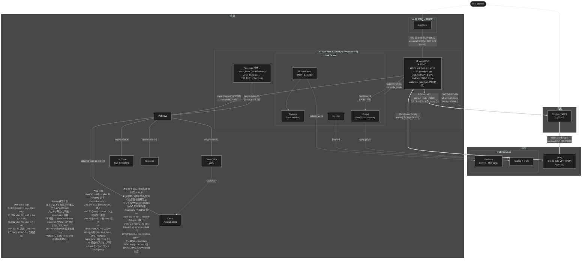

```mermaid
---
config:
  layout: dagre
  theme: dark
---
flowchart TB
 subgraph s1["自宅"]
        r1["Router / NAPT<br>AS65002<br>"]
  end
 subgraph server["Local Server"]
        grafana_l["Grafana<br>(local monitor)"]
        snmp["Prometheus<br>SNMP Exporter"]
        syslog_l["rsyslog"]
        nfcapd_l["nfcapd<br>(NetFlow collector)"]
  end
 subgraph gce["GCE Services"]
        grafana_a["Grafana<br>(active / 外部公開)"]
        syslog_a["rsyslog + GCS"]
  end
 subgraph GCP["GCP"]
        vgw["VGW<br>Site-to-Site VPN (BGP)<br>AS64512"]
        gce
  end
 subgraph unmanaged["⚠️ 管理外 (会場設備)"]
        r2["blackbox"]
  end
 subgraph s2["会場"]
        n1["192.168.0.0/16<br>11.0/24 vlan 11: mgmt (v4 only)<br>30.0/24 vlan 30: staff + live (v4 + v6)<br>40.0/22 vlan 40: user (v4 + v6)<br>vlan 30, 40 共通: DHCPv6-PD /64 (OPTAGE→自宅経由)"]
        n2["Router構築方針<br>当日プロキシ解除が不確実のため VyOS採用<br>プロキシ無効化可能 → WireGuard 直接<br>不可能 → WireGuard over wstunnel (WSS/TCP 443)<br>上位は常に wg0 (BGP/IPv6/firewall 設定を統一)<br>wg0 MTU 1380 (wstunnel 経由時も対応)"]
        n4["ACL (v4)<br>vlan 30 (staff) → vlan 11 (mgmt): 許可<br>vlan 40 (user) → 192.168.11.1 (default GW): 許可<br>vlan 40 (user) → vlan 11 (上記以外): 拒否<br>vlan 40 (user) → 他 vlan: 拒否<br>---<br>IPv6: vlan 30, 40 は同一 /64 を共有 (RA: A=1, M=1, O=1, RDNSS)<br>mgmt (vlan 11) は v6 なし → v6 経由のアクセス不可<br>ndppd でインバウンド NDP proxy"]
        n5["通信ログ保存 (法執行機関対応) + AUP<br>利用規約: 通信記録の告知 + 公序良俗違反禁止<br>ランダムMAC: per-SSID固定のため対策不要 (hostname で補助識別)<br>---<br>NetFlow v9: r3 → nfcapd (5-tuple, 180日)<br>DNS クエリログ: r3 dns forwarding (qname+client IP)<br>DHCP forensic log: r3 dhcp-server (IP↔MAC↔hostname)<br>NDP dump: r3 cron 1分 (IPv6↔MAC, iOS/Android対応)"]
        subgraph proxmox["Dell OptiPlex 3070 Micro (Proxmox VE)"]
            pve["Proxmox ホスト<br>vmbr_trunk (VLAN-aware)<br>vmbr_trunk.11 → 192.168.11.3 (mgmt)"]
            r3["r3-vyos (VM)<br>AS65001<br>eth2 trunk (virtio) + eth3 USB passthrough<br>DNS / DHCP / BGP / NetFlow / NDP dump<br>wstunnel (podman, 内部動作)"]
            server
        end
        sw["PoE SW<br>"]
        ap3_8["Cisco<br>Aironet 3800"]
        wlc["Cisco 3504<br>WLC"]
        unmanaged
        pc1["YouTube<br>Live Streaming"]
        pc3["Speaker"]
  end
    Internet(["The Internet"]) --> r1 & r2
    r2 -- "WG 直接時: UDP 51820<br>wstunnel 経由時: TCP 443 (WSS)" --- r3
    r3 == BGP on VPN<br>default route (AD20)<br>(v4 ユーザートラフィック) ==> r1
    r3 -. "DHCPv6-PD /64<br>v6 default route<br>(via WireGuard)" .-> r1
    r3 -- "trunk (tagged 11/30/40)<br>via vmbr_trunk" --- sw
    r3 -- "tagged vlan 11<br>via vmbr_trunk" --- server
    pve -- "tagged vlan 11<br>(vmbr_trunk.11)" --- sw
    r3 -. "NetFlow v9<br>(UDP 2055)" .-> nfcapd_l
    sw -- allowed vlan 11, 30, 40 --- ap3_8
    sw -- native vlan 11 --- wlc
    wlc -. CAPWAP .-> ap3_8
    sw -- native vlan 30 --- pc1
    sw -- native vlan 30 --- pc3
    r3 == "WireGuard (wg1)<br>primary BGP (AS65001)" ==> vgw
    r1 == "WireGuard (wg1)<br>backup BGP (AS65002)" ==> vgw
    syslog_l -. forward .-> syslog_a
    snmp -. remote_write .-> grafana_a
    snmp -.-> grafana_l
    nfcapd_l -. "rsync (15分)" .-> syslog_a

    n1@{ shape: text}
    n2@{ shape: text}
    n4@{ shape: text}
    n5@{ shape: text}
```