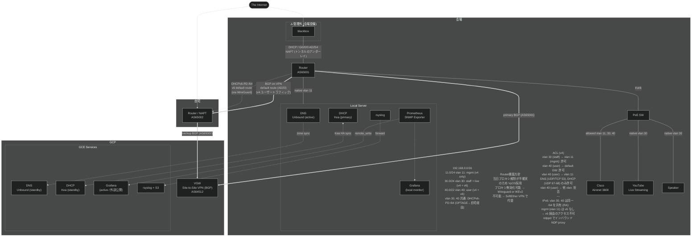

```mermaid
---
config:
  layout: dagre
  theme: dark
---
flowchart TB
 subgraph s1["自宅"]
        r1["Router / NAPT<br>AS65002<br>"]
  end
 subgraph server["Local Server"]
        dns["DNS<br>Unbound (active)"]
        dhcp["DHCP<br>Kea (primary)"]
        grafana_l["Grafana<br>(local monitor)"]
        snmp["Prometheus<br>SNMP Exporter"]
        syslog_l["rsyslog"]
  end
 subgraph gce["GCE Services"]
        dns_a["DNS<br>Unbound (standby)"]
        dhcp_a["DHCP<br>Kea (standby)"]
        grafana_a["Grafana<br>(active / 外部公開)"]
        syslog_a["rsyslog + S3"]
  end
 subgraph GCP["GCP"]
        vgw["VGW<br>Site-to-Site VPN (BGP)<br>AS64512"]
        gce
  end
 subgraph unmanaged["⚠️ 管理外 (会場設備)"]
        r2["blackbox"]
  end
 subgraph s2["会場"]
        n1["192.168.0.0/16<br>11.0/24 vlan 11: mgmt (v4 only)<br>30.0/24 vlan 30: staff + live (v4 + v6)<br>40.0/22 vlan 40: user (v4 + v6)<br>vlan 30, 40 共通: DHCPv6-PD /64 (OPTAGE→自宅経由)"]
        n2["Router構築方針<br>当日プロキシ解除が不確実のため VyOS採用<br>プロキシ無効化可能 → Wireguard or IKEv2<br>不可能 → SoftEther VPN で代替"]
        n4["ACL (v4)<br>vlan 30 (staff) → vlan 11 (mgmt): 許可<br>vlan 40 (user) → default GW: 許可<br>vlan 40 (user) → vlan 11: DNS (UDP/TCP 53), DHCP (UDP 67-68) のみ許可<br>vlan 40 (user) → 他 vlan: 拒否<br>---<br>IPv6: vlan 30, 40 は同一 /64 を共有 (RA)<br>mgmt (vlan 11) は v6 なし → v6 経由のアクセス不可<br>ndppd でインバウンド NDP proxy"]
        r3["Router<br>AS65001"]
        sw["PoE SW<br>"]
        ap3_8["Cisco<br>Aironet 3800"]
        server
        unmanaged
        pc1["YouTube<br>Live Streaming"]
        pc3["Speaker"]
  end
    Internet(["The Internet"]) --> r1 & r2
    r2 -- DHCP / Gi0/0/0 AD254<br>NAPT (トンネルのアンダーレイ) --- r3
    r3 == BGP on VPN<br>default route (AD20)<br>(v4 ユーザートラフィック) ==> r1
    r3 -. "DHCPv6-PD /64<br>v6 default route<br>(via WireGuard)" .-> r1
    r3 -- trunk --- sw
    r3 -- native vlan 11 --- server
    sw -- allowed vlan 11, 30, 40 --- ap3_8
    sw -- native vlan 30 --- pc1
    sw -- native vlan 30 --- pc3
    r3 == primary BGP (AS65001) ==> vgw
    r1 == backup BGP (AS65002) ==> vgw
    dhcp <-. Kea HA sync .-> dhcp_a
    dns -. zone sync .-> dns_a
    syslog_l -. forward .-> syslog_a
    snmp -. remote_write .-> grafana_a
    snmp -.-> grafana_l

    n1@{ shape: text}
    n2@{ shape: text}
    n4@{ shape: text}
```