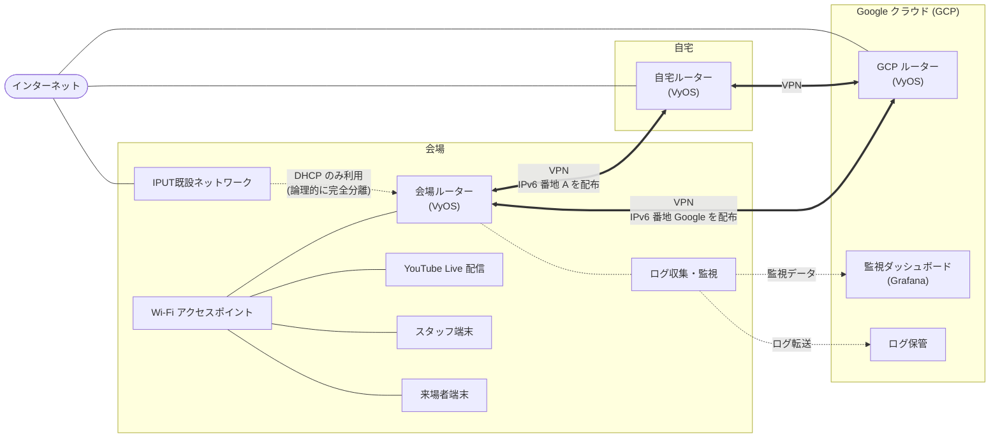

# BwAI in Kwansai 2026 ネットワーク概要

非エンジニア向けの全体像です。技術的な詳細は [BwAI.md](../BwAI.md) および [docs/design/](design/) を参照してください。

---

## なぜ自前ネットワークを用意するのか

インターネットは本来、TCP ポート 22 に世界中から攻撃が飛んでくるほど「自由」なものです。
ポートや通信先が制限されたネットワークは、エンジニアにとって
YouTube Kids や Windows S モードを強制されるようなもの――
「開発者モード」という言葉が存在するように、制限付きの環境では開発体験そのものが損なわれます。

エンジニアが集まるイベントだからこそ、**制限のないインターネット**を提供します。

会場 (IPUT) の既設回線はプロキシこそ解除されますが、ポート制限が残ります。
そこで **VPN トンネルで通信の出口 (NAPT) を自宅回線と GCP に移す** ことで、
IPUT のネットワークには負荷や攻撃リスクを与えず、制限のない接続を実現します。
IPUT 既設ネットワークとは論理的に完全分離されており、VPN のトンネル用に DHCP アドレスを借りるだけです。

各拠点 (会場・自宅・GCP) にはすべて同じ VyOS ルーターを配置し、
3 拠点間を **フルメッシュ VPN** で相互接続しています。
どの経路が落ちても残りの 2 経路で通信を継続できます。

---

## 全体構成図 (概要)

---

## 技術的チャレンジ: デュアルプレフィックス RA

本イベントでは、IPv6 の接続方式に **デュアルプレフィックス RA** という先進的な手法を採用しています。

| 用語 | かんたんな説明 |
|------|--------------|
| IPv6 | 現行の IPv4 に代わる次世代インターネットアドレス体系 |
| プレフィックス | ネットワークの「住所の番地」にあたる識別子 |
| RA (Router Advertisement) | ルーターが「この番地を使ってください」と端末に通知する仕組み |

通常、1 つのネットワークには 1 つの番地 (プレフィックス) だけを配りますが、
本構成では **自宅回線と GCP の 2 つの経路からそれぞれ異なる番地を同時に配布** します。
端末は 2 つの IPv6 アドレスを持ち、通信先に応じて最適な経路を自動選択できます。

### なぜ挑戦的なのか

この手法は、日本最大級のネットワーク技術者カンファレンス
**[JANOG57](https://segre.hatenablog.com/entry/2026/03/31/163914)** の会場ネットワークでも採用された構成です。
IPv6 の仕様上、端末が番地と経路を正しく紐付ける保証がない
([RFC 6724 の未解決課題](https://segre.hatenablog.com/entry/2026/01/18/183203))
ため、大規模イベントでの実運用例はまだ少なく、業界でも注目されている取り組みです。

BwAI in Kwansai では、コミュニティイベント規模でこの技術に挑戦します。

---

## 3 つのネットワーク区画

| 区画 | 誰が使うか | できること |
|------|-----------|-----------|
| **管理用** | ネットワーク機器のみ | 機材の設定・監視 |
| **スタッフ・配信用** | 登壇者・スタッフ・配信 PC | インターネット + 管理機材への接続 |
| **来場者用** | 一般来場者 | インターネットのみ (管理機材には接続不可) |

---

## 通信ログの保存について

法令に基づき、以下のログを一定期間保管します。
利用規約 (AUP) で来場者に事前告知します。

- **誰がどの IP アドレスを使ったか** (DHCP ログ)
- **どこに通信したか** (通信フローの 5 項目記録)
- **どのサイト名を問い合わせたか** (DNS ログ)

> 通信の中身 (メール本文など) は記録しません。

---

## 主な機材

| 機材 | 役割 |
|------|------|
| Dell OptiPlex 3070 Micro | 会場ルーター・監視サーバーを動かす小型 PC |
| Cisco Aironet 3700, 3800 | 業務用 Wi-Fi アクセスポイント |
| Cisco 3504 WLC | Wi-Fi の集中管理コントローラー |
| PoE スイッチ | 各機材をつなぐ LAN スイッチ (電源供給兼用) |

---

## 障害時の備え

| リスク | 対策 |
|--------|------|
| 会場のポート制限で VPN が通らない | 許可ポートを経由する第 2 の接続方式を用意 |
| 自宅回線が落ちた場合 | 3 拠点フルメッシュ VPN のため、GCP 経由に自動切替 |
| GCP に障害が起きた場合 | 会場 ↔ 自宅の直接 VPN で通信継続 |
| 会場ネット自体が不通 | 管理用ネットワークは独立しており、機材操作は継続可能 |

---

## 規模感

- 想定来場者数: **200 名以上**
- 前回実績: 約 100 名 / 100 台接続
- Google DevRel Central からカメラクルー・ゲストも来場予定 → ネットワーク信頼性が特に重要
